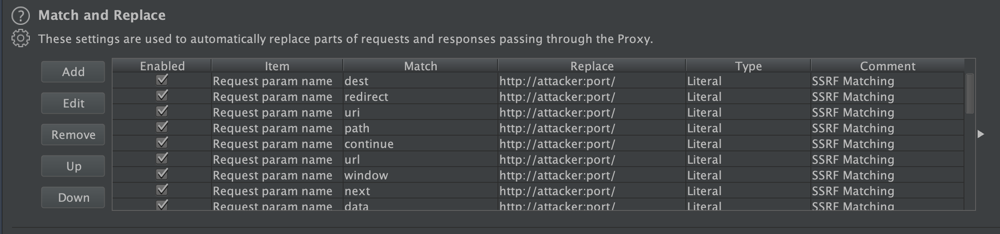
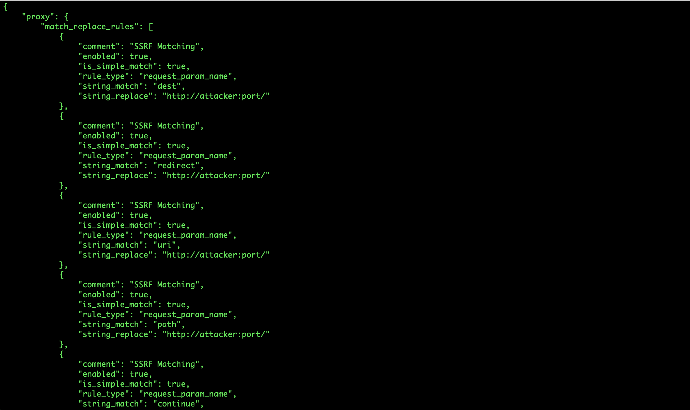

<p align="center">

</p>

<hr>
 <h3 align="center">Match and Replace Script for BurpSuite</h3>
 
 <p align="center">

</p>
<p align="center">

</p>

### Main Features
* Generate Match and Replace options from a file
* Create presets for your attack
* Output to a JSON file


### Usage
``` usage: generate.py [-h] [-f FILE] [-c COMMENT] [-r RULE] [-s REPLACE] [-o OUTPUT] ```

### Optional Arguments:
  * -h, --help            show this help message and exit
  * -f FILE, --file FILE  Parameters/Variables to be Matched
  * -c COMMENT, --comment COMMENT
                        Comment or Bug Class [SSRF, RCE, XSS ..etc]
  * -r RULE, --rule RULE  Rule Type [request_header,request_body ...etc]
  * -s REPLACE, --replace REPLACE
                        Literal String to Replace
  * -o OUTPUT, --output OUTPUT
                        Option JSON file


#### Example
``` ./generate.py -f parameters.txt -c "SSRF Matching" --rule "request_param_name" --replace "http://attacker:port/" --output opt.json ```

## Contribution, Credits & License
### Ways to contribute

* Suggest a feature
* Report a bug
* Fixing Issues

Licensed under the GNU GPLv3, see LICENSE for more information.
